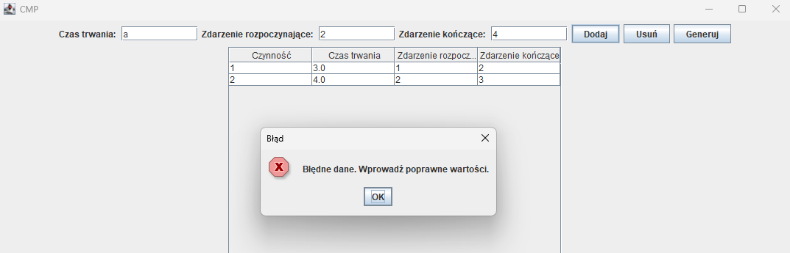

# Critical Path Method
Implementation of Critical Path Method. 
The project involves developing a Java-based windowed application that comes with a user-friendly GUI, utilizing the IntelliJ IDEA environment.

In the windowed application, the user enters information about all activities, and the application then calculates the key parameters for the critical path method (CPM) and presents the results in two tables: one table displays activities, and the other displays events. At the bottom of the window, the critical path and duration are displayed. The program handles errors related to incorrect data entered by the user.

- The first window for user data input

- The second window displaying the results

- Examples of how errors are handled

